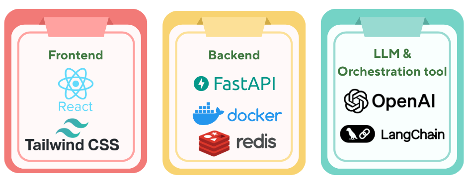

# Affective Data Storytelling using LLM

This application is part of my Master's Dissertation project on generating data storytelling using large language models (LLMs). Although the term _data storytelling_ lacks a unified definition in the community, its primary goal is to communicate the insights from the dataset using visualisation and narratives to engage the user [1,2]. To make the narrative more engaging and resonate with the reader, emotional tone has been incorporated [3].

With the rise of LLMs and their capabilities in summarising and generating stories, this research explored how to utilise these capabilities and make generating data stories easier for both tech and non-tech. The user can input the CSV time-series dataset, file description and emotional tone to shape how the story is presented.

# Tech Stack



# Run the application

This repository contains the frontend application.

To run the application locally:

```
npm run serve
```

For the application to work, it must be run along with the backend API, which is located in this repository [Data Story Backend](https://github.com/ikenichaa/data-story-backend)

# Application Demo
